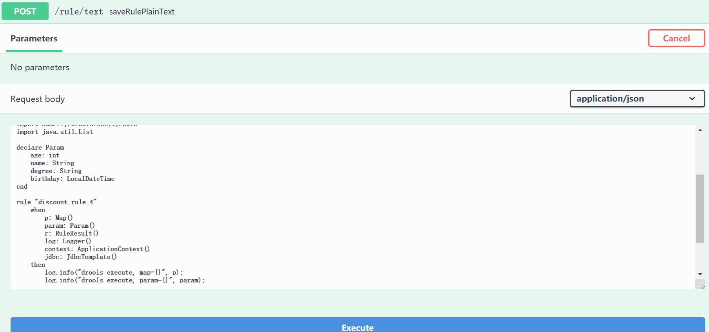
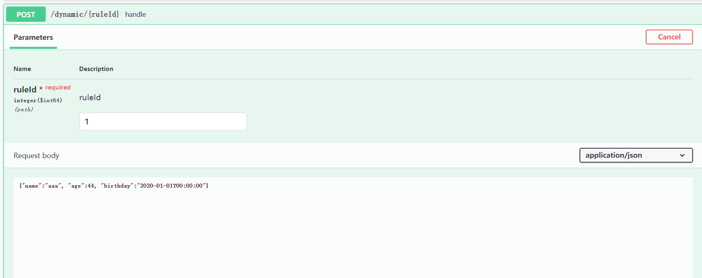

#基于Drools实现动态接口

##1. 核心原理
通过字符串获取一个规则容器，进而获取session执行规则;  
我们会在session中插入必要的工具类，例如spring的容器，jdbcTemplate等
```java
KieContainer container = new KieHelper().addContent(rule, DRL).getKieContainer();
KieSession session = container.newKieSession();
//设置日志和spring容器
session.insert(log);
session.insert(context);
session.insert(jdbcTemplate);
```

其中规则类似如下，在rules文件夹下的dynamic.drl中：
```drools
package rules

import com.fly.drools.entity.RuleResult
import org.slf4j.Logger
import org.slf4j.LoggerFactory
import org.springframework.context.ApplicationContext
import com.fly.drools.test.TestService
import java.util.Map
import java.time.LocalDateTime
import org.springframework.jdbc.core.JdbcTemplate
import org.springframework.jdbc.core.BeanPropertyRowMapper
import com.fly.drools.entity.Rule
import java.util.List

declare Param
    age: int
    name: String
    degree: String
    birthday: LocalDateTime
end

rule "discount_rule_4"
    when
        param: Param()
        r: RuleResult()
        log: Logger()
        context: ApplicationContext()
        jdbc: JdbcTemplate()
    then
        log.info("drools execute, param={}", param);

        TestService t = context.getBean(TestService.class);
        String res = t.test("123456");
        r.setData("hello world: " + param.getName());
        log.info("test spring context: {}", res);
        List<Rule> list = jdbc.query("select * from tb_rule", new BeanPropertyRowMapper<>(Rule.class));
        log.info("rule list = {}", list);
end
```

##2.使用方法

启动项目后，可以看到RuleController接口，用户新增修改删除规则；
调用保存接口新增一个规则，返回该规则的ID  

然后可以在DynamicController中对该规则进行调用；



